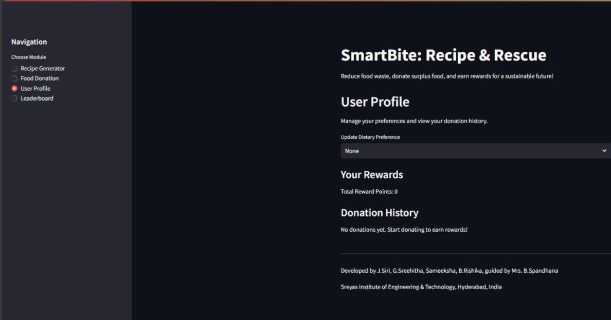

# SmartBite: Recipe & Rescue 

SmartBite is an AI-powered web application designed to reduce food waste and promote food donation. It helps users:
- Generate smart recipes based on leftover ingredients
- Detect nearby food banks to donate excess food
- Earn reward points and climb a leaderboard to encourage sustainability

#  Features

 **SmartBite Recipe Generator**  
- Enter ingredients you have
- Get recipe suggestions powered by Spoonacular API  
- Includes recipe title, ingredients, and instructions

 **Multilingual Translation**  
- Translate ingredients to/from any language using Google Translate API

 **Food Donation Finder**  
- Map view of nearby food banks using geolocation and Folium

**Reward Points System**  
- Earn points for donations
- Track your impact on food waste

**Leaderboard**  
- Compare scores and ranks with other contributors

# 🛠️ Built With

-  **Python** – Core programming language  
-  **Spoonacular API** – For recipe suggestions  
-  **Streamlit** – Web app interface  
-  **Folium & Geocoder** – Map and geolocation  
-  **Googletrans** – Translation support  
-  **BeautifulSoup** – (If used for scraping, optional)

# 📦 Installation

Make sure you have Python and pip installed. Then follow these steps:

```bash
# Clone the repository
git clone https://github.com/sirireddy818/smartbite.git
cd smartbite

# Install required dependencies
pip install -r requirements.txt

# Run the application
streamlit run app.py


# Screenshots

#  Recipe Generator


# Food Donation 


# Leaderboard


 #Community LeaderBoard
 
